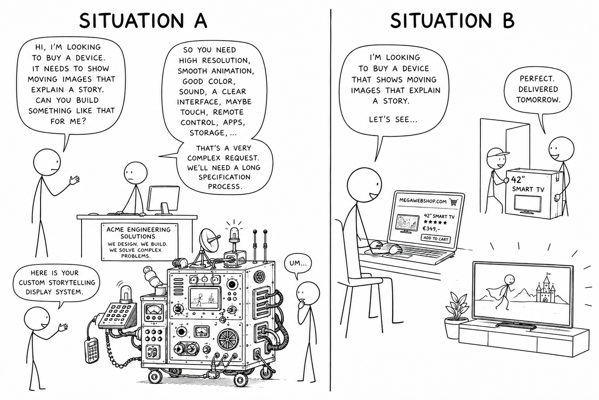

In 2020, quickly after the start of my PhD, I started asking myself a question. Suppose that tomorrow I have the best prediction model in the world, one that detects every basal cell carcinoma there is. What would I do next?

I never had a good answer. Even then it was obvious that dropping a model into a clinical workflow was far from trivial, and that the hard part started where my research stopped.

Six years later the question has become harder, because we are no longer shipping classifiers. We are shipping agents. A classifier gives you one output and you can design around it. An agent holds a conversation, memory, works across text and images at once, and behaves differently depending on how the person engaged with it.

And look at what we point these agents at. Not the simple problems (or at least we should not). A good GUI and some code have handled well defined tasks for over thirty years. The promise of this technology is the messy, non-linear, high complexity work, which means the interface has to carry that complexity too. Put a slide, a report and a model's reasoning in front of a pathologist at once and you ask them to hold all of it at the same time. Do that badly and you have added work instead of removing it.

Two studies last week show how little we still understand about this. In the first, twenty one pathologists read the same difficult kidney cancer cases, with and without AI. On average it helped. Underneath that average the readers split into two groups, some leaning on the model heavily, others keeping it at a distance, and neither seniority nor years of experience explained who ended up where.

In the second, radiologists worked with an assistant that explained its reasoning. Well written explanations made them less likely to dismiss the model when it was right, and more likely to follow it when it was wrong.

Together they say something we underestimate. The interface is not a neutral window onto the model. Communication now runs from the human, through a visual interface, into text, to the model, and back again. Every step in that chain shapes what the clinician decides, in a direction unrelated to whether the model is correct, and differently for different people. Neither study tells us why. Trust, habit, time pressure, interpretation.

This is the work almost nobody budgets for or investigates. You definitely do not find it by training another model. You find it by sitting with the people who will use the thing. Not asking them what to build, they cannot tell you that. Observing them. Showing them new possibilities and watching what actually happens.

Often it's the same model, same capabilities, two different interfaces. One of them people quietly stop opening. The other becomes the first thing they open every morning.

So when hospitals announce big budgets for building their own AI solutions, I always wonder what they think the expensive part is.

