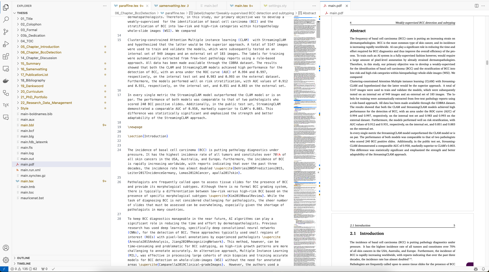

When writing my thesis, I found Overleaf to be a bit too minimalistic for managing a large project such as a PhD Thesis. Installing LaTeX in Visual Studio Code (VSCode) really helped me to work in a modern, customizable text editor. In this post, we'll go through the process of installing LaTeX on macOS using Homebrew, configuring VSCode with LaTeX Workshop, and syncing with Overleaf for collaborative writing and reviewing. Please note that the LaTeX installation can take a while, since updating and downloading packages can be time-consuming.

## Step 1: Install Homebrew (if not already installed)

First, if you don't have Homebrew installed, open your terminal and enter the following command:

```bash
/bin/bash -c "$(curl -fsSL https://raw.githubusercontent.com/Homebrew/install/HEAD/install.sh)"
```

This will install Homebrew, a package manager for macOS, making it easy to install LaTeX and other software.

## Step 2: Install LaTeX via Homebrew

Once Homebrew is installed, you can install LaTeX by running the following command in your terminal:

```bash
brew install --cask mactex-no-gui
```

This command installs the **MacTeX-no-GUI** version, which includes the full LaTeX environment without any graphical applications (such as TeXShop). The download and installation can take a while to start, so be patient—it may seem like nothing is happening initially, but it will eventually begin downloading.

After installation, update LaTeX packages to ensure you have the latest versions. You will need to restart your terminal before running the following commands:

```bash
sudo tlmgr update --self
sudo tlmgr update --all
```

This ensures your LaTeX environment is fully up to date. If you encounter any issues during the installation or update process, check the terminal output for error messages and try to resolve them accordingly. For me, it helped to run `eval "$(/usr/libexec/path_helper)"` and restart my terminal.

## Step 3: Install VSCode

If you haven't installed Visual Studio Code yet, you can download and install it from the [official VSCode website](https://code.visualstudio.com/).

Once installed, open VSCode and prepare to add the necessary extensions for LaTeX.

## Step 4: Install the LaTeX Workshop Extension

VSCode doesn't natively support LaTeX, so we need to install an extension called **LaTeX Workshop**. This extension provides LaTeX syntax highlighting, compilation, previews, and other useful features.

To install it:
1. Open **VSCode**.
2. Go to the **Extensions** view by clicking on the Extensions icon on the sidebar or pressing `Cmd` + `Shift` + `X`.
3. Search for **LaTeX Workshop**.
4. Click **Install**.

Once installed, LaTeX Workshop will automatically manage compiling your LaTeX files and displaying previews.

### Configuring LaTeX Workshop:
You can customize LaTeX Workshop by going to the settings (open `Cmd` + `,`) and searching for **LaTeX Workshop**. You’ll find options for how you want your documents to compile, preview behavior, and more. For now, you can leave the default settings as they are.

## Step 5: Enable Word Wrap in VSCode

LaTeX files can often contain long lines of text, and horizontal scrolling is inconvenient. To make your experience smoother, enable **word wrap** in VSCode so that long lines break automatically within the window.

### To enable word wrap globally:
1. Open VSCode settings (`Cmd` + `,`).
2. Search for **word wrap**.
3. Set **Editor: Word Wrap** to `on`.

Alternatively, you can set word wrap for individual sessions by using the keyboard shortcut `Alt` + `Z`.

Another way to enable word wrap is by using the **Command Palette**:
1. Open the Command Palette by pressing `Cmd` + `Shift` + `P`.
2. Type **Word Wrap** and select **View: Toggle Word Wrap**.

This ensures that lines automatically break without requiring horizontal scrolling.

## Step 6: Syncing VSCode with Overleaf for Collaboration and Reviews

While VSCode offers a great environment for writing and compiling LaTeX documents, Overleaf is fantastic for collaboration, reviewing, and sharing with others. You can leverage both platforms by syncing your project between Overleaf and VSCode.

### Setting up Overleaf for Git Synchronization

1. **Create or Open a Project on Overleaf**: 
   Start by either creating a new project on Overleaf or selecting an existing project that you want to sync with.

2. **Enable Git on Overleaf**: 
   Overleaf allows you to connect your project to a private Git repository. To do this:
   - Open your Overleaf project.
   - Go to the **Menu** (top left).
   - Scroll down to **GitHub**.
   - Follow the instructions to allow Overleaf to create a private Git repository for your project.

3. **Clone the Repository in VSCode**: 
   Once Overleaf creates the repository, you can clone it to your local machine:
   ```bash
   git clone <your-overleaf-git-url>
   ```
   After cloning, you can open the project in VSCode.

4. **Add the `.gitignore` File**:
   Add a `.gitignore` file to your project to exclude unnecessary LaTeX-generated files (like `.aux`, `.log`, etc.). A nice `.gitignore` template for LaTeX projects can be found [here](https://github.com/github/gitignore/blob/main/TeX.gitignore
).
5. **Working in VSCode**:
   You can now work on your LaTeX document in VSCode, take advantage of the full LaTeX Workshop experience, and perform heavy-duty tasks like editing large files or compiling complex documents.

6. **Syncing with Overleaf**:
   If you want to review or share a version, simply push your changes back to the Overleaf repository:
   ```bash
   git push origin master
   ```

   Overleaf will not automatically update with the latest version, for this you will have to manually pull the changes from GitHub in Overleaf.

   To do this:
   - Open your Overleaf project.
   - Go to the **Menu** (top left).
   - Scroll down to **GitHub**.
   - Press the button to **Pull changes from GitHub**.

   Make sure to resolve any conflicts that may arise during the pull process. The best way is to make sure everything is pushed to GitHub before pulling in Overleaf.

7. **Collaborate and Review on Overleaf**:
   Once your collaborators or reviewers have made changes on Overleaf, you can pull those changes back into your local repository:
   ```bash
   git pull origin master
   ```
   This way, you can synchronize changes between Overleaf and VSCode seamlessly, using Overleaf for easy collaboration and VSCode for more ease of work.

## Step 7: Compile and Preview

Here is a quick preview of how it looks when you have set everything up. You can see the LaTeX code on the left and the preview on the right. By default, auto-compilation is enabled, which means the preview will update automatically when you save the file (or have autosave enabled). I recommend enabling autosave on all your projects. In this case, I switched my theme to a light theme because the dark-themed editor created too much contrast compared to the preview.



With LaTeX installed via Homebrew and configured in VSCode using the LaTeX Workshop extension, you now have a powerful setup for writing LaTeX documents. Additionally, by syncing your project with Overleaf, you can easily collaborate with others, review changes, and keep everything in sync using Git. The installation and setup may take some time, especially when using the `brew` command, but once it's complete, you’ll have a smooth and customizable LaTeX environment.